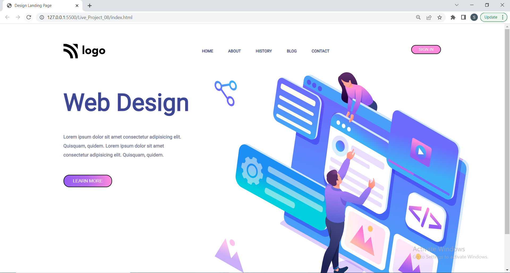
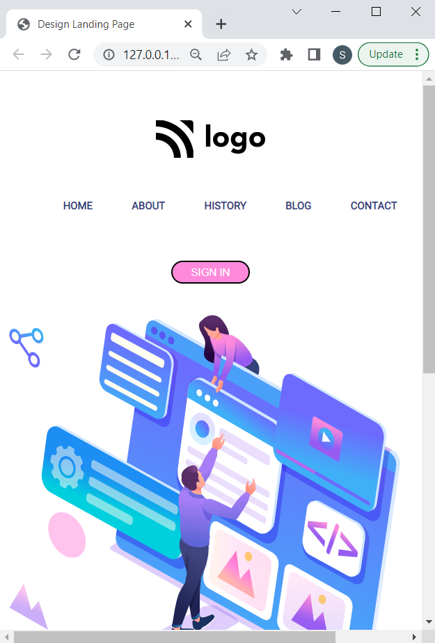
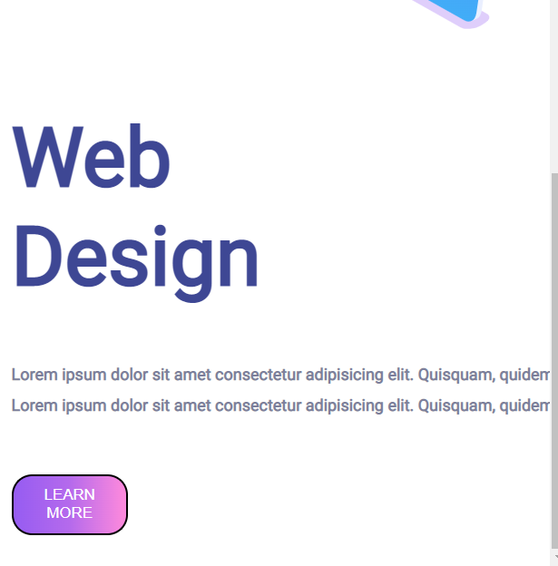

# Web-Designer-Website []

This is basically a one pager Template project made in HTML/CSS for an imaginary web Design Service on the internet.
Hope you like my project !! it works good in laptop screen if you are using desktop please zoom in or out that might work .

## 🛠 Technologies Used
  - HTML - Hyper Text Markup Language
  - CSS - Cascadeing Spread Sheet
  - CSS Flex box

## 🚩 Demo
### Laptop View


### Mobile Screen View




Clone the project

```bash
  git clone https://github.com/suhas-sm/Web-designer-website.git
```

Go to the project directory

```bash
  cd Web-designer-website
```
## ✍️ Author and 📞 Contact
- [Find-coder](https://www.findcoder.io/u/suhas_sm)
    - [](https://www.facebook.com/suhas.melmuri)
    - [](https://www.instagram.com/_suhas_sm/)

## 📝 Features

- One Pager Website
- Good Background Image
- Beautifull UI/UX Design
- Image Position and alignment

## 🤔 What i have learnt By working on this project
1. I have improved my self in positioning of images in a spesific position, also using absolute positioning
2. Improved in designing the project
3. Making it responsivness in better way

## 😌 Honest Time to finish the project

I had took about 2 hours. This project made me understand how to make an image positioned with respect to other.

## 👀 Feedback

If you have any feedback, please reach out to us at melmurissm11@gmail.com